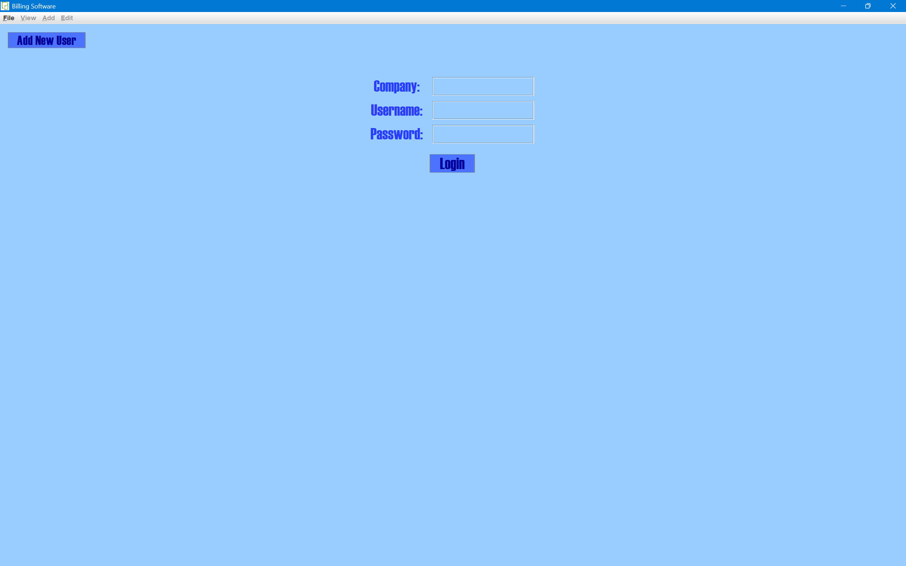
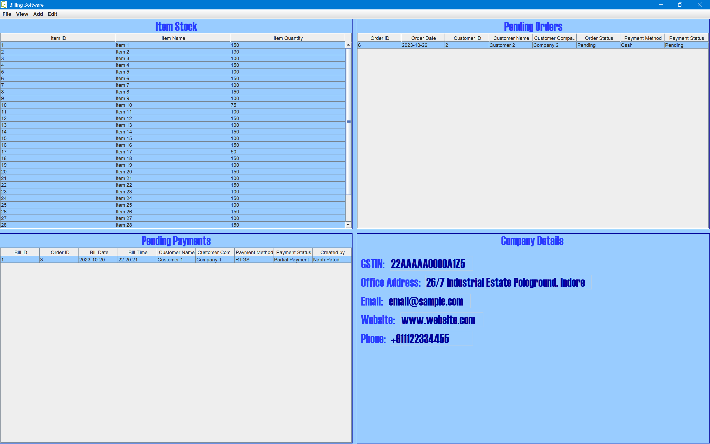
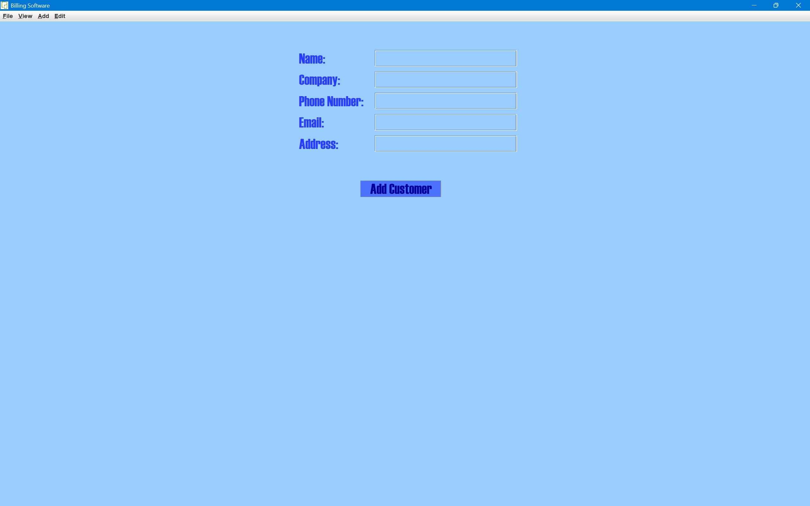
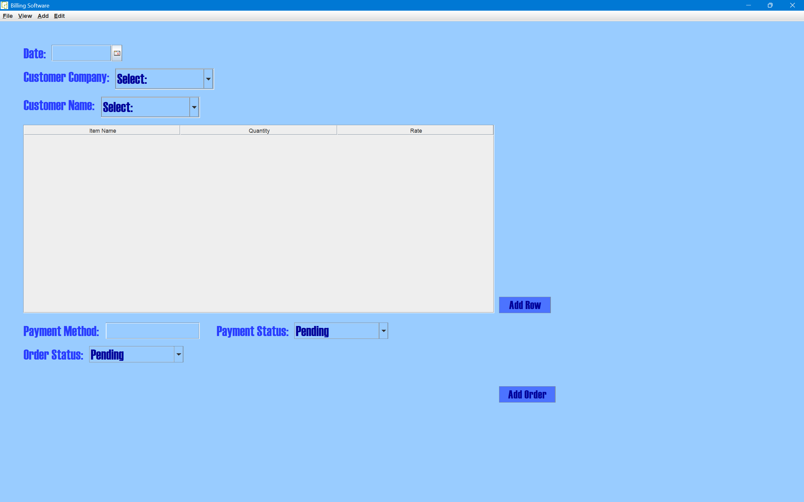
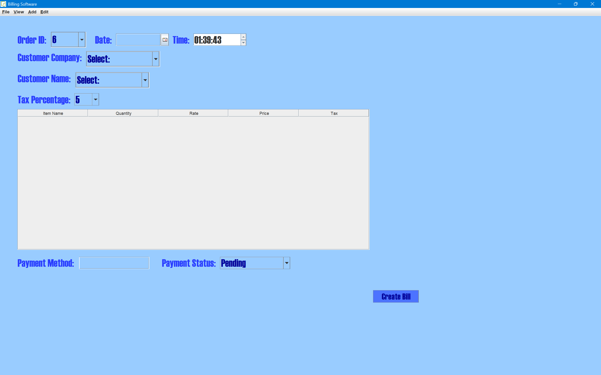
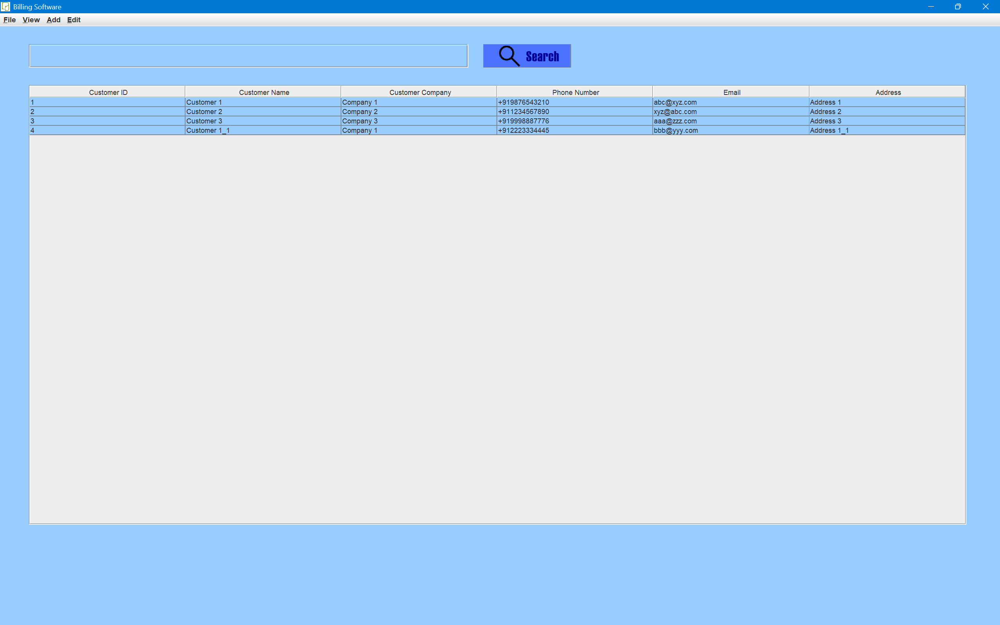
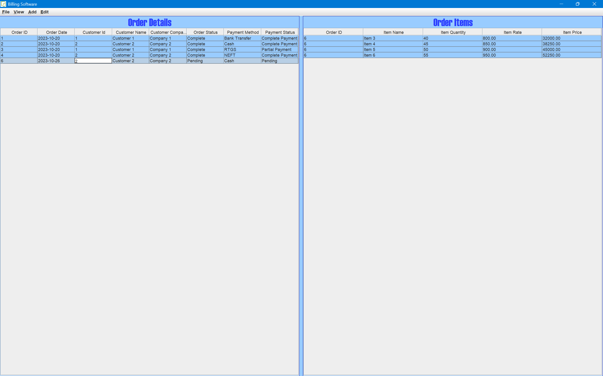
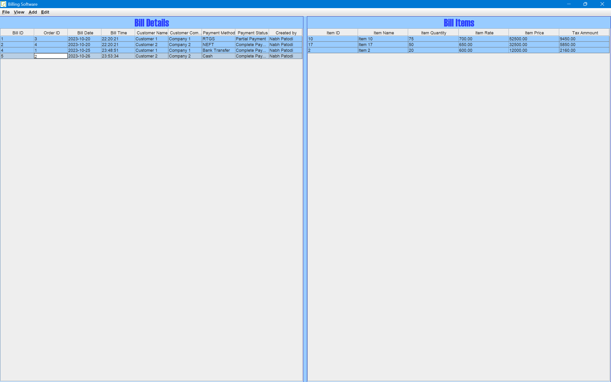

# Billing System Project

The Billing System project is a Java-based application developed using Java Swing for the graphical user interface, JCalendar for date selection, and MySQL for database management. This application offers a comprehensive suite of features for managing billing-related tasks, including customer management, inventory control, order processing, and payment tracking.

## Table of Contents

- [Features](#features)
- [Requirements](#requirements)
- [Setup](#setup)
- [Usage](#usage)
- [Screenshots](#screenshots)
- [Contributing](#contributing)
- [License](#license)

## Features

The Billing System project includes the following features:

1. **User Authentication:**
   - User login using a unique username and password.
   - User signup to create a new account.

2. **Inventory Management:**
   - Display current stock levels for various items.
   - Add, edit, or remove items from the inventory.

3. **Order Processing:**
   - Create and manage customer orders.
   - Track pending orders and order details.

4. **Customer Management:**
   - Add and edit customer information.
   - View customer details.

5. **Billing and Invoicing:**
   - Create bills and invoices for customer orders.
   - View and edit billing details.

6. **Payment Tracking:**
   - Monitor and update payment details for each customer's order.
   - Track pending payments and payment history.

7. **Company Information:**
   - Store and update company-specific details for branding and legal requirements.

## Requirements

To run the Billing System project, you need the following:

- Java Development Kit (JDK)
- MySQL Database
- MySQL Connector/J library
- Java Swing for GUI
- JCalendar library

## Setup

1. **Database Setup:**

   - Create a MySQL database for the project.
   - Import the database schema using the provided SQL script.

2. **Java Configuration:**

   - Ensure you have JDK installed on your system.
   - Download and add the MySQL Connector/J and JCalendar libraries to your project.

3. **IDE Setup (Optional):**

   - Import the project into your favorite Java IDE.

## Usage

1. **Compile and Run:**

   - Compile and run the `application.java` file.

2. **Login or Signup:**

   - If you have an existing account, log in using your username and password.
   - To create a new account, use the signup option.

3. **Navigation:**

   - Use the buttons in the main menu to navigate through the application.
   - Access various sections like inventory, customer management, order processing, billing, and company information.

4. **Transactions:**

   - Follow on-screen instructions to complete transactions, such as adding items, creating orders, generating bills, and tracking payments.

5. **Log Out:**

   - To log out of your account, use the "Log Out" button.

## Screenshots

## Contributing

We welcome contributions from the community. If you want to contribute to this project, please follow these steps:

1. Fork the repository.
2. Create a new branch for your feature or bug fix.
3. Make your changes and commit them.
4. Create a pull request with a detailed description of your changes.

## License

This project is licensed under the MIT License - see the [LICENSE](LICENSE) file for details.
